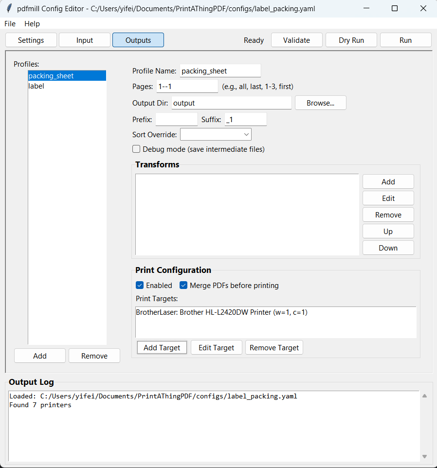

# pdfmill

[](https://github.com/dingyifei/PrintAThingPDF/actions/workflows/python-package.yml)

A configurable PDF processing pipeline for splitting, transforming, and printing PDFs.

Currently, supports only windows



## Features

- **YAML Configuration**: Define processing pipelines in simple config files
- **Page Selection**: Select pages by index, range, or pattern (`first`, `last`, `odd`, `even`)
- **Transformations**: Rotate, crop, and resize pages with precise control
- **Multi-Output**: Split one PDF into multiple outputs with different settings
- **Batch Processing**: Process single files or entire directories
- **Input Filtering**: Filter PDFs by filename pattern or text content keywords
- **Input Sorting**: Sort files by name or timestamp before processing
- **Printing**: Send outputs to different printers with custom settings
- **Multi-Printer Distribution**: Split pages across multiple printers by speed/weight
- **Dry Run**: Preview what will happen before processing

## Installation

```sh
# Clone and install in development mode
git clone https://github.com/dingyifei/pdfmill.git
cd pdfmill
pip install -e .

# SumatraPDF.exe will be automatically downloaded on first use
```

## Quick Start

```sh
# List available printers
pdfm --list-printers

# Process PDFs with a config file
pdfm -c configs/label_packing.yaml -i ./input -o ./output

# Process a single file
pdfm -c configs/label_packing.yaml -i document.pdf

# Dry run (see what would happen)
pdfm -c configs/label_packing.yaml -i ./input --dry-run

# Validate a config file
pdfm -c configs/label_packing.yaml --validate
```

## Configuration

Create a YAML config file to define your processing pipeline:

```yaml
version: 1

settings:
  on_error: continue  # or "stop"
  cleanup_source: false
  cleanup_output_after_print: false

outputs:
  packing_sheet:
    pages: "1--1"  # all pages except last
    output_dir: ./output
    filename_suffix: "_packing"
    print:
      enabled: true
      printer: "Canon G3060 series"

  label:
    pages: "last"
    transforms:
      - rotate: 270
      - crop:
          lower_left: [82, 260]
          upper_right: [514, 548]
    output_dir: ./output
    filename_suffix: "_label"
    print:
      enabled: true
      printer: "Label Printer"
```

### Input Filtering and Sorting

Filter which PDFs to process by filename pattern or text content, and control processing order:

```yaml
input:
  path: ./input
  pattern: "shipping_*.pdf"  # glob pattern for filenames
  sort: name_asc             # sort files before processing
  filter:
    keywords: ["shipping", "label"]  # text content keywords
    match: "any"  # "any" = OR logic, "all" = AND logic
```

| Option | Description |
|--------|-------------|
| `pattern` | Glob pattern for filename matching (default: `*.pdf`) |
| `sort` | Sort order: `name_asc`, `name_desc`, `time_asc`, `time_desc` |
| `filter.keywords` | List of keywords to search in PDF text content |
| `filter.match` | `"any"` matches if any keyword found, `"all"` requires all keywords |

Sorting can also be set per output profile using `sort:` at the profile level. If both input-level and profile-level sort are set, an error is raised.

Keyword matching is case-sensitive. PDFs without searchable text won't match keyword filters.

### Page Selection Syntax

| Syntax | Meaning |
|--------|---------|
| `[1, 2, 3]` | Exact pages 1, 2, 3 |
| `"1-3"` | Pages 1 through 3 |
| `"3-"` | Page 3 to end |
| `"-2"` | Last 2 pages |
| `"1--1"` | Page 1 to second-to-last |
| `"first"` | First page only |
| `"last"` | Last page only |
| `"odd"` | All odd-numbered pages |
| `"even"` | All even-numbered pages |
| `"all"` | All pages |

### Transforms

```yaml
transforms:
  # Rotate by degrees
  - rotate: 270  # 0, 90, 180, 270

  # Or rotate to orientation
  - rotate: landscape  # landscape, portrait

  # Crop to coordinates (supports units: mm, in, pt, cm)
  - crop:
      lower_left: [0, 0]           # raw points (72 per inch)
      upper_right: [288, 432]
  - crop:
      lower_left: ["10mm", "20mm"]  # with units
      upper_right: ["100mm", "150mm"]

  # Resize with units
  - size:
      width: 100mm   # supports: mm, in, pt, cm
      height: 150mm
      fit: contain   # contain, cover, stretch
```

### Debug Mode

Enable `debug: true` on an output profile to save intermediate PDFs after each transform step:

```yaml
outputs:
  label:
    debug: true  # saves intermediate files
    pages: "last"
    transforms:
      - rotate: 90
      - crop:
          lower_left: ["33mm", "91mm"]
          upper_right: ["180mm", "192mm"]
    output_dir: ./output
```

This generates files showing each processing stage:
```
./output/
├── myfile_label_step0_selected.pdf   # after page selection
├── myfile_label_step1_rotate90.pdf   # after rotation
├── myfile_label_step2_crop.pdf       # after crop
└── myfile_label.pdf                  # final output
```

### Print Options

**Single printer (simple):**
```yaml
print:
  enabled: true
  printer: "Printer Name"
  copies: 1
  merge: true   # merge all PDFs before printing as single job
  args: []      # pass-through SumatraPDF arguments
```

When `merge: true` is set, all output files for that profile are combined into a single PDF before being sent to the printer. This is useful for batch printing where you want all pages in one print job.

**Multi-printer distribution:**
```yaml
print:
  enabled: true
  merge: true
  targets:
    fast_printer:
      printer: "HP LaserJet"
      weight: 100    # higher = more pages (e.g., printer's ppm)
      copies: 1
    slow_printer:
      printer: "Brother"
      weight: 50
      copies: 1
```

When multiple targets are configured with `merge: true`:
- Pages are distributed across printers based on weight ratio
- Higher-weight printers get the first pages (for proper stacking order)
- Example: 10 pages with weights 100:50 → fast gets pages 1-7, slow gets 8-10

When `merge: false` with multiple targets:
- Each file is sent to all targets (copy distribution)
- Each target uses its own `copies` count

| Target Option | Description |
|---------------|-------------|
| `printer` | Printer name (required) |
| `weight` | Page distribution weight (default: 1) |
| `copies` | Number of copies (default: 1) |
| `args` | Pass-through SumatraPDF arguments |

## Example Configs

See the `configs/` directory for ready-to-use examples:

- `label_packing.yaml` - Split PDFs into packing sheet + shipping label
- `six_page.yaml` - Process 6-page PDFs (remove pages 1-2, rotate pages 4-5)
- `multi_printer.yaml` - Multi-printer distribution with sorting

## Requirements

- Python 3.10+
- Windows 10 or newer

## License

MIT License
